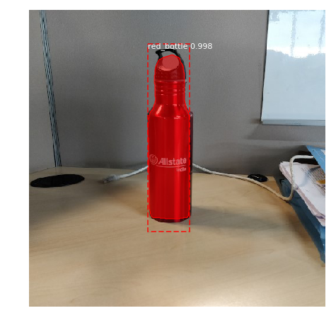
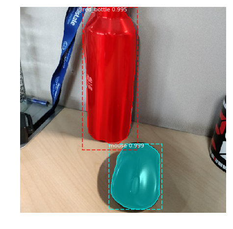
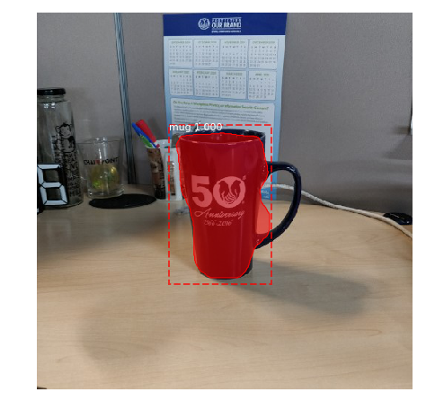

# MaskRCNN-ObjectSegmentation
Creating own fake dataset with segmentation json files on required objects to detect with appropriate backgrounds to increase the accuracy of the model. I have tried using matterport mask rcnn and got pretty good results. 

Below are few predicted results

 
