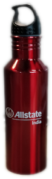
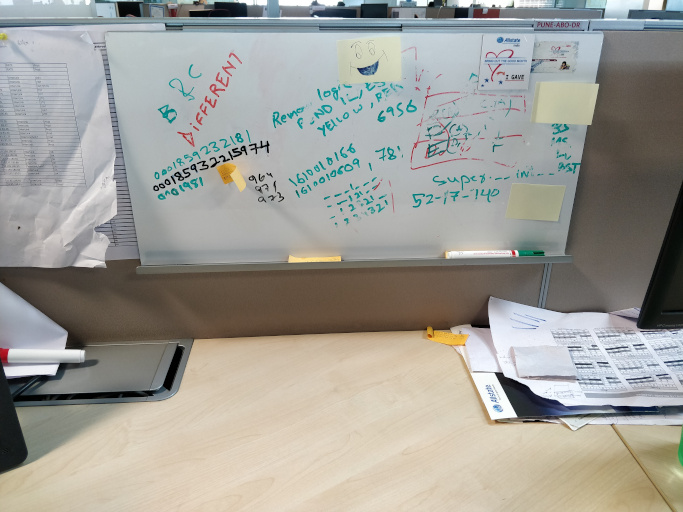
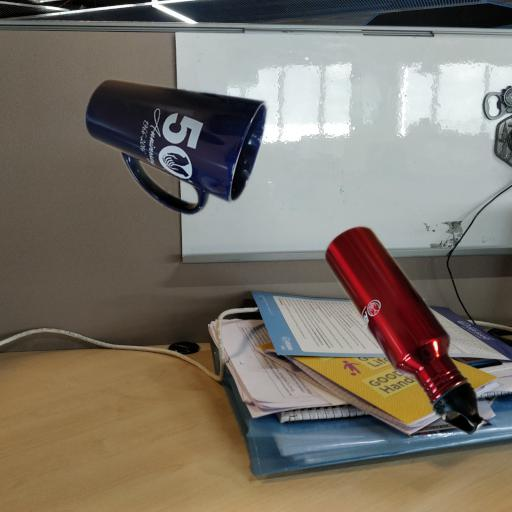
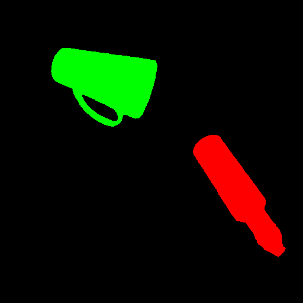
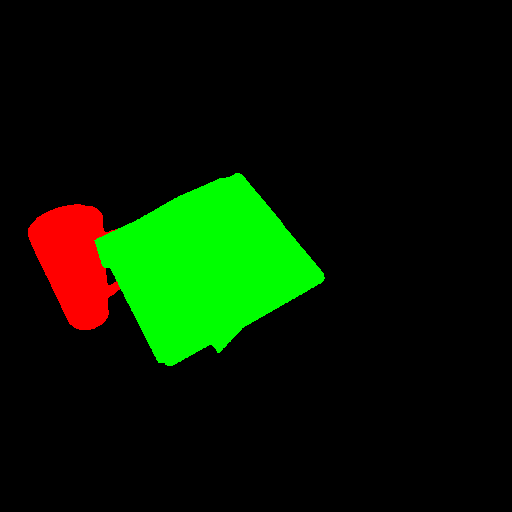

# MaskRCNN-ObjectSegmentation
Creating own fake dataset with segment annotations json files on required objects to detect with appropriate backgrounds to increase the accuracy of the model. I have tried using matterport mask rcnn and got pretty good results. 

Below are few predicted results:

 

### Dataset creation with coco dataset format segmentation masks
For this sample model I have selected 4 different objects i.e., mug, red bottle, viop, mouse(wireless mouse). I have cropped the object images to extract just the object and got different background images. 

    

These cropped objects will be placed on background images randomnly with different object combinations and mask images will also get created with mask definitions .json file in coco dataset annotations format i.e., (synthetic_dataset/train/mask_definitions.json) for training set and (synthetic_dataset/val/mask_definitions.json) for validation set.

From tarining set 

  

From validation set 

 

python/image_composition.py is used to create artificial datasets for training and validation with mask_definitions.json files. synthetic_dataset/val/dataset_info.json can be created manually and enter the details console when python/image_composition.py is executed.

Using train-validation sets generated images and mask_definitions.json files with respective dataset_info.json files in coco instatnce format to create coco_instances.json file (synthetic_dataset/train/coco_instances.json & synthetic_dataset/val/coco_instances.json). Need to the python/coco_json_utils.py file.

#### Note: Above all code is compatible with python 3.5

### Creating and training the model using mask rcnn

Matterport's implementation of Mask R-CNN is used to train on synthetic dataset, then used the trained weights to run inference on new images.

I have used Google Cloud Platform (GCP) instance with four 16GB P100's to train the model.

P100 GPU 16GB*4

Python 3.5

Keras 2.3.0

tensorflow-gpu 1.14.0

Please go through the notebook https://github.com/AbhinayReddyYarva/MaskRCNN-ObjectSegmentation/blob/master/notebooks/train_mask_rcnn.ipynb

#### Note: Before starting the model to train, two files need to be updated in matterport mask rcnn repo to fix AttributeError and RuntimeError.

Please go through the readme.md file in matter_mask_rcnn - https://github.com/AbhinayReddyYarva/MaskRCNN-ObjectSegmentation/blob/master/matterport_mask_rcnn/README.md
